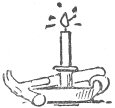
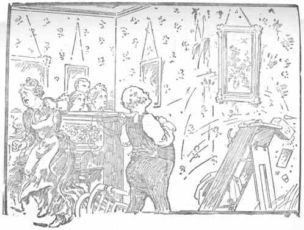
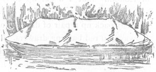
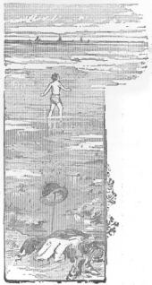

### CHAPTER III.

*Arrangements settled.—Harris’s method of doing work.—How the elderly, family-man puts up a picture.—George makes a sensible, remark.—Delights of early morning bathing.—Provisions for getting upset.*

So, on the following evening, we again assembled, to discuss and arrange our plans. Harris said: 
“Now, the first thing to settle is what to take with us. Now, you get a bit of paper and write down, J., and you get the grocery catalogue, George, and somebody give me a bit of pencil, and then I’ll make out a list.” 
That’s Harris all over—so ready to take the burden of everything himself, and put it on the backs of other people. 
He always reminds me of my poor Uncle Podger. You never saw such a commotion up and down a house, in all your life, as when my Uncle Podger undertook to do a job. A picture would have come home from the frame-maker’s, and be standing in the dining-room, waiting to be put up; and Aunt Podger would ask what was to be done with it, and Uncle Podger would say: 
“Oh, you leave that to _me_. Don’t you, any of you, worry yourselves about that. _I’ll_ do all that.” 
And then he would take off his coat, and begin. He would send the girl out for sixpen’orth of nails, and then one of the boys after her to tell her what size to get; and, from that, he would gradually work down, and start the whole house. 

### 

“Now you go and get me my hammer, Will,” he would shout; “and you bring me the rule, Tom; and I shall want the step-ladder, and I had better have a kitchen-chair, too; and, Jim! you run round to Mr. Goggles, and tell him, ‘Pa’s kind regards, and hopes his leg’s better; and will he lend him his spirit-level?’ And don’t you go, Maria, because I shall want somebody to hold me the light; and when the girl comes back, she must go out again for a bit of picture-cord; and Tom!—where’s Tom?—Tom, you come here; I shall want you to hand me up the picture.” 
And then he would lift up the picture, and drop it, and it would come out of the frame, and he would try to save the glass, and cut himself; and then he would spring round the room, looking for his handkerchief. He could not find his handkerchief, because it was in the pocket of the coat he had taken off, and he did not know where he had put the coat, and all the house had to leave off looking for his tools, and start looking for his coat; while he would dance round and hinder them. 

### 

“Doesn’t anybody in the whole house know where my coat is? I never came across such a set in all my life—upon my word I didn’t. Six of you!—and you can’t find a coat that I put down not five minutes ago! Well, of all the—” 
Then he’d get up, and find that he had been sitting on it, and would call out: 
“Oh, you can give it up! I’ve found it myself now. Might just as well ask the cat to find anything as expect you people to find it.” 
And, when half an hour had been spent in tying up his finger, and a new glass had been got, and the tools, and the ladder, and the chair, and the candle had been brought, he would have another go, the whole family, including the girl and the charwoman, standing round in a semi-circle, ready to help. Two people would have to hold the chair, and a third would help him up on it, and hold him there, and a fourth would hand him a nail, and a fifth would pass him up the hammer, and he would take hold of the nail, and drop it. 
“There!” he would say, in an injured tone, “now the nail’s gone.” 
And we would all have to go down on our knees and grovel for it, while he would stand on the chair, and grunt, and want to know if he was to be kept there all the evening. 
The nail would be found at last, but by that time he would have lost the hammer. 
“Where’s the hammer? What did I do with the hammer? Great heavens! Seven of you, gaping round there, and you don’t know what I did with the hammer!” 
We would find the hammer for him, and then he would have lost sight of the mark he had made on the wall, where the nail was to go in, and each of us had to get up on the chair, beside him, and see if we could find it; and we would each discover it in a different place, and he would call us all fools, one after another, and tell us to get down. And he would take the rule, and re-measure, and find that he wanted half thirty-one and three-eighths inches from the corner, and would try to do it in his head, and go mad. 
And we would all try to do it in our heads, and all arrive at different results, and sneer at one another. And in the general row, the original number would be forgotten, and Uncle Podger would have to measure it again. 
He would use a bit of string this time, and at the critical moment, when the old fool was leaning over the chair at an angle of forty-five, and trying to reach a point three inches beyond what was possible for him to reach, the string would slip, and down he would slide on to the piano, a really fine musical effect being produced by the suddenness with which his head and body struck all the notes at the same time. 
And Aunt Maria would say that she would not allow the children to stand round and hear such language. 
At last, Uncle Podger would get the spot fixed again, and put the point of the nail on it with his left hand, and take the hammer in his right hand. And, with the first blow, he would smash his thumb, and drop the hammer, with a yell, on somebody’s toes. 
Aunt Maria would mildly observe that, next time Uncle Podger was going to hammer a nail into the wall, she hoped he’d let her know in time, so that she could make arrangements to go and spend a week with her mother while it was being done. 
“Oh! you women, you make such a fuss over everything,” Uncle Podger would reply, picking himself up. “Why, I _like_ doing a little job of this sort.” 

### 

And then he would have another try, and, at the second blow, the nail would go clean through the plaster, and half the hammer after it, and Uncle Podger be precipitated against the wall with force nearly sufficient to flatten his nose. 
Then we had to find the rule and the string again, and a new hole was made; and, about midnight, the picture would be up—very crooked and insecure, the wall for yards round looking as if it had been smoothed down with a rake, and everybody dead beat and wretched—except Uncle Podger. 
“There you are,” he would say, stepping heavily off the chair on to the charwoman’s corns, and surveying the mess he had made with evident pride. “Why, some people would have had a man in to do a little thing like that!” 
Harris will be just that sort of man when he grows up, I know, and I told him so. I said I could not permit him to take so much labour upon himself. I said: 
“No; _you_ get the paper, and the pencil, and the catalogue, and George write down, and I’ll do the work.” 
The first list we made out had to be discarded. It was clear that the upper reaches of the Thames would not allow of the navigation of a boat sufficiently large to take the things we had set down as indispensable; so we tore the list up, and looked at one another! 
George said: 
“You know we are on a wrong track altogether. We must not think of the things we could do with, but only of the things that we can’t do without.” 
George comes out really quite sensible at times. You’d be surprised. I call that downright wisdom, not merely as regards the present case, but with reference to our trip up the river of life, generally. How many people, on that voyage, load up the boat till it is ever in danger of swamping with a store of foolish things which they think essential to the pleasure and comfort of the trip, but which are really only useless lumber. 
How they pile the poor little craft mast-high with fine clothes and big houses; with useless servants, and a host of swell friends that do not care twopence for them, and that they do not care three ha’pence for; with expensive entertainments that nobody enjoys, with formalities and fashions, with pretence and ostentation, and with—oh, heaviest, maddest lumber of all!—the dread of what will my neighbour think, with luxuries that only cloy, with pleasures that bore, with empty show that, like the criminal’s iron crown of yore, makes to bleed and swoon the aching head that wears it! 
It is lumber, man—all lumber! Throw it overboard. It makes the boat so heavy to pull, you nearly faint at the oars. It makes it so cumbersome and dangerous to manage, you never know a moment’s freedom from anxiety and care, never gain a moment’s rest for dreamy laziness—no time to watch the windy shadows skimming lightly o’er the shallows, or the glittering sunbeams flitting in and out among the ripples, or the great trees by the margin looking down at their own image, or the woods all green and golden, or the lilies white and yellow, or the sombre-waving rushes, or the sedges, or the orchis, or the blue forget-me-nots. 
Throw the lumber over, man! Let your boat of life be light, packed with only what you need—a homely home and simple pleasures, one or two friends, worth the name, someone to love and someone to love you, a cat, a dog, and a pipe or two, enough to eat and enough to wear, and a little more than enough to drink; for thirst is a dangerous thing. 
You will find the boat easier to pull then, and it will not be so liable to upset, and it will not matter so much if it does upset; good, plain merchandise will stand water. You will have time to think as well as to work. Time to drink in life’s sunshine—time to listen to the Æolian music that the wind of God draws from the human heart-strings around us—time to— 
I beg your pardon, really. I quite forgot. 
Well, we left the list to George, and he began it. 

### 

“We won’t take a tent,” suggested George; “we will have a boat with a cover. It is ever so much simpler, and more comfortable.” 
It seemed a good thought, and we adopted it. I do not know whether you have ever seen the thing I mean. You fix iron hoops up over the boat, and stretch a huge canvas over them, and fasten it down all round, from stem to stern, and it converts the boat into a sort of little house, and it is beautifully cosy, though a trifle stuffy; but there, everything has its drawbacks, as the man said when his mother-in-law died, and they came down upon him for the funeral expenses. 
George said that in that case we must take a rug each, a lamp, some soap, a brush and comb (between us), a toothbrush (each), a basin, some tooth-powder, some shaving tackle (sounds like a French exercise, doesn’t it?), and a couple of big-towels for bathing. I notice that people always make gigantic arrangements for bathing when they are going anywhere near the water, but that they don’t bathe much when they are there. 

### 

It is the same when you go to the sea-side. I always determine—when thinking over the matter in London—that I’ll get up early every morning, and go and have a dip before breakfast, and I religiously pack up a pair of drawers and a bath towel. I always get red bathing drawers. I rather fancy myself in red drawers. They suit my complexion so. But when I get to the sea I don’t feel somehow that I want that early morning bathe nearly so much as I did when I was in town. 
On the contrary, I feel more that I want to stop in bed till the last moment, and then come down and have my breakfast. Once or twice virtue has triumphed, and I have got out at six and half-dressed myself, and have taken my drawers and towel, and stumbled dismally off. But I haven’t enjoyed it. They seem to keep a specially cutting east wind, waiting for me, when I go to bathe in the early morning; and they pick out all the three-cornered stones, and put them on the top, and they sharpen up the rocks and cover the points over with a bit of sand so that I can’t see them, and they take the sea and put it two miles out, so that I have to huddle myself up in my arms and hop, shivering, through six inches of water. And when I do get to the sea, it is rough and quite insulting. 
One huge wave catches me up and chucks me in a sitting posture, as hard as ever it can, down on to a rock which has been put there for me. And, before I’ve said “Oh! Ugh!” and found out what has gone, the wave comes back and carries me out to mid-ocean. I begin to strike out frantically for the shore, and wonder if I shall ever see home and friends again, and wish I’d been kinder to my little sister when a boy (when I was a boy, I mean). Just when I have given up all hope, a wave retires and leaves me sprawling like a star-fish on the sand, and I get up and look back and find that I’ve been swimming for my life in two feet of water. I hop back and dress, and crawl home, where I have to pretend I liked it. 
In the present instance, we all talked as if we were going to have a long swim every morning. 
George said it was so pleasant to wake up in the boat in the fresh morning, and plunge into the limpid river. Harris said there was nothing like a swim before breakfast to give you an appetite. He said it always gave him an appetite. George said that if it was going to make Harris eat more than Harris ordinarily ate, then he should protest against Harris having a bath at all. 
He said there would be quite enough hard work in towing sufficient food for Harris up against stream, as it was. 
I urged upon George, however, how much pleasanter it would be to have Harris clean and fresh about the boat, even if we did have to take a few more hundredweight of provisions; and he got to see it in my light, and withdrew his opposition to Harris’s bath. 
Agreed, finally, that we should take _three_ bath towels, so as not to keep each other waiting. 
For clothes, George said two suits of flannel would be sufficient, as we could wash them ourselves, in the river, when they got dirty. We asked him if he had ever tried washing flannels in the river, and he replied: “No, not exactly himself like; but he knew some fellows who had, and it was easy enough;” and Harris and I were weak enough to fancy he knew what he was talking about, and that three respectable young men, without position or influence, and with no experience in washing, could really clean their own shirts and trousers in the river Thames with a bit of soap. 
We were to learn in the days to come, when it was too late, that George was a miserable impostor, who could evidently have known nothing whatever about the matter. If you had seen these clothes after—but, as the shilling shockers say, we anticipate. 
George impressed upon us to take a change of under-things and plenty of socks, in case we got upset and wanted a change; also plenty of handkerchiefs, as they would do to wipe things, and a pair of leather boots as well as our boating shoes, as we should want them if we got upset. 
 
