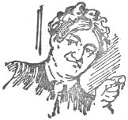
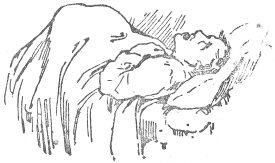
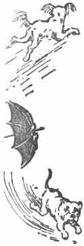
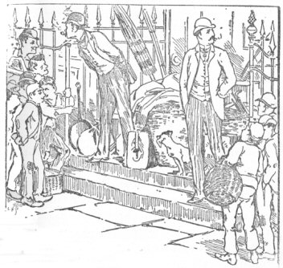

### CHAPTER V.

*Mrs. P. arouses us.—George, the sluggard.—The “weather forecast” swindle.—Our luggage.—Depravity of the small boy.—The people gather round us.—We drive off in great style, and arrive at Waterloo.—Innocence of South Western Officials concerning such worldly things as trains.—We are afloat, afloat in an open boat.*

### 

It was Mrs. Poppets that woke me up next morning. 
She said: 
“Do you know that it’s nearly nine o’clock, sir?” 
“Nine o’ what?” I cried, starting up. 
“Nine o’clock,” she replied, through the keyhole. “I thought you was a-oversleeping yourselves.” 
I woke Harris, and told him. He said: 
“I thought you wanted to get up at six?” 
“So I did,” I answered; “why didn’t you wake me?” 
“How could I wake you, when you didn’t wake me?” he retorted. “Now we shan’t get on the water till after twelve. I wonder you take the trouble to get up at all.” 
“Um,” I replied, “lucky for you that I do. If I hadn’t woke you, you’d have lain there for the whole fortnight.” 

### 

We snarled at one another in this strain for the next few minutes, when we were interrupted by a defiant snore from George. It reminded us, for the first time since our being called, of his existence. There he lay—the man who had wanted to know what time he should wake us—on his back, with his mouth wide open, and his knees stuck up. 
I don’t know why it should be, I am sure; but the sight of another man asleep in bed when I am up, maddens me. It seems to me so shocking to see the precious hours of a man’s life—the priceless moments that will never come back to him again—being wasted in mere brutish sleep. 
There was George, throwing away in hideous sloth the inestimable gift of time; his valuable life, every second of which he would have to account for hereafter, passing away from him, unused. He might have been up stuffing himself with eggs and bacon, irritating the dog, or flirting with the slavey, instead of sprawling there, sunk in soul-clogging oblivion. 
It was a terrible thought. Harris and I appeared to be struck by it at the same instant. We determined to save him, and, in this noble resolve, our own dispute was forgotten. We flew across and slung the clothes off him, and Harris landed him one with a slipper, and I shouted in his ear, and he awoke. 
“Wasermarrer?” he observed, sitting up. 
“Get up, you fat-headed chunk!” roared Harris. “It’s quarter to ten.” 
“What!” he shrieked, jumping out of bed into the bath; “Who the thunder put this thing here?” 
We told him he must have been a fool not to see the bath. 
We finished dressing, and, when it came to the extras, we remembered that we had packed the tooth-brushes and the brush and comb (that tooth-brush of mine will be the death of me, I know), and we had to go downstairs, and fish them out of the bag. And when we had done that George wanted the shaving tackle. We told him that he would have to go without shaving that morning, as we weren’t going to unpack that bag again for him, nor for anyone like him. 
He said: 
“Don’t be absurd. How can I go into the City like this?” 
It was certainly rather rough on the City, but what cared we for human suffering? As Harris said, in his common, vulgar way, the City would have to lump it. 

### 

We went downstairs to breakfast. Montmorency had invited two other dogs to come and see him off, and they were whiling away the time by fighting on the doorstep. We calmed them with an umbrella, and sat down to chops and cold beef. 
Harris said: 
“The great thing is to make a good breakfast,” and he started with a couple of chops, saying that he would take these while they were hot, as the beef could wait. 
George got hold of the paper, and read us out the boating fatalities, and the weather forecast, which latter prophesied “rain, cold, wet to fine” (whatever more than usually ghastly thing in weather that may be), “occasional local thunder-storms, east wind, with general depression over the Midland Counties (London and Channel). Bar. falling.” 
I do think that, of all the silly, irritating tomfoolishness by which we are plagued, this “weather-forecast” fraud is about the most aggravating. It “forecasts” precisely what happened yesterday or the day before, and precisely the opposite of what is going to happen to-day. 
I remember a holiday of mine being completely ruined one late autumn by our paying attention to the weather report of the local newspaper. “Heavy showers, with thunderstorms, may be expected to-day,” it would say on Monday, and so we would give up our picnic, and stop indoors all day, waiting for the rain.—And people would pass the house, going off in wagonettes and coaches as jolly and merry as could be, the sun shining out, and not a cloud to be seen. 
“Ah!” we said, as we stood looking out at them through the window, “won’t they come home soaked!” 
And we chuckled to think how wet they were going to get, and came back and stirred the fire, and got our books, and arranged our specimens of seaweed and cockle shells. By twelve o’clock, with the sun pouring into the room, the heat became quite oppressive, and we wondered when those heavy showers and occasional thunderstorms were going to begin. 
“Ah! they’ll come in the afternoon, you’ll find,” we said to each other. “Oh, _won’t_ those people get wet. What a lark!” 
At one o’clock, the landlady would come in to ask if we weren’t going out, as it seemed such a lovely day. 
“No, no,” we replied, with a knowing chuckle, “not we. _We_ don’t mean to get wet—no, no.” 
And when the afternoon was nearly gone, and still there was no sign of rain, we tried to cheer ourselves up with the idea that it would come down all at once, just as the people had started for home, and were out of the reach of any shelter, and that they would thus get more drenched than ever. But not a drop ever fell, and it finished a grand day, and a lovely night after it. 
The next morning we would read that it was going to be a “warm, fine to set-fair day; much heat;” and we would dress ourselves in flimsy things, and go out, and, half-an-hour after we had started, it would commence to rain hard, and a bitterly cold wind would spring up, and both would keep on steadily for the whole day, and we would come home with colds and rheumatism all over us, and go to bed. 
The weather is a thing that is beyond me altogether. I never can understand it. The barometer is useless: it is as misleading as the newspaper forecast. 
There was one hanging up in a hotel at Oxford at which I was staying last spring, and, when I got there, it was pointing to “set fair.” It was simply pouring with rain outside, and had been all day; and I couldn’t quite make matters out. I tapped the barometer, and it jumped up and pointed to “very dry.” The Boots stopped as he was passing, and said he expected it meant to-morrow. I fancied that maybe it was thinking of the week before last, but Boots said, No, he thought not. 
I tapped it again the next morning, and it went up still higher, and the rain came down faster than ever. On Wednesday I went and hit it again, and the pointer went round towards “set fair,” “very dry,” and “much heat,” until it was stopped by the peg, and couldn’t go any further. It tried its best, but the instrument was built so that it couldn’t prophesy fine weather any harder than it did without breaking itself. It evidently wanted to go on, and prognosticate drought, and water famine, and sunstroke, and simooms, and such things, but the peg prevented it, and it had to be content with pointing to the mere commonplace “very dry.” 
Meanwhile, the rain came down in a steady torrent, and the lower part of the town was under water, owing to the river having overflowed. 
Boots said it was evident that we were going to have a prolonged spell of grand weather _some time_, and read out a poem which was printed over the top of the oracle, about 
“Long foretold, long last; Short notice, soon past.” 
The fine weather never came that summer. I expect that machine must have been referring to the following spring. 
Then there are those new style of barometers, the long straight ones. I never can make head or tail of those. There is one side for 10 a.m. yesterday, and one side for 10 a.m. to-day; but you can’t always get there as early as ten, you know. It rises or falls for rain and fine, with much or less wind, and one end is “Nly” and the other “Ely” (what’s Ely got to do with it?), and if you tap it, it doesn’t tell you anything. And you’ve got to correct it to sea-level, and reduce it to Fahrenheit, and even then I don’t know the answer. 
But who wants to be foretold the weather? It is bad enough when it comes, without our having the misery of knowing about it beforehand. The prophet we like is the old man who, on the particularly gloomy-looking morning of some day when we particularly want it to be fine, looks round the horizon with a particularly knowing eye, and says: 
“Oh no, sir, I think it will clear up all right. It will break all right enough, sir.” 
“Ah, he knows”, we say, as we wish him good-morning, and start off; “wonderful how these old fellows can tell!” 
And we feel an affection for that man which is not at all lessened by the circumstances of its _not_ clearing up, but continuing to rain steadily all day. 
“Ah, well,” we feel, “he did his best.” 
For the man that prophesies us bad weather, on the contrary, we entertain only bitter and revengeful thoughts. 
“Going to clear up, d’ye think?” we shout, cheerily, as we pass. 
“Well, no, sir; I’m afraid it’s settled down for the day,” he replies, shaking his head. 
“Stupid old fool!” we mutter, “what’s _he_ know about it?” And, if his portent proves correct, we come back feeling still more angry against him, and with a vague notion that, somehow or other, he has had something to do with it. 
It was too bright and sunny on this especial morning for George’s blood-curdling readings about “Bar. falling,” “atmospheric disturbance, passing in an oblique line over Southern Europe,” and “pressure increasing,” to very much upset us: and so, finding that he could not make us wretched, and was only wasting his time, he sneaked the cigarette that I had carefully rolled up for myself, and went. 
Then Harris and I, having finished up the few things left on the table, carted out our luggage on to the doorstep, and waited for a cab. 

### 

There seemed a good deal of luggage, when we put it all together. There was the Gladstone and the small hand-bag, and the two hampers, and a large roll of rugs, and some four or five overcoats and macintoshes, and a few umbrellas, and then there was a melon by itself in a bag, because it was too bulky to go in anywhere, and a couple of pounds of grapes in another bag, and a Japanese paper umbrella, and a frying pan, which, being too long to pack, we had wrapped round with brown paper. 
It did look a lot, and Harris and I began to feel rather ashamed of it, though why we should be, I can’t see. No cab came by, but the street boys did, and got interested in the show, apparently, and stopped. 
Biggs’s boy was the first to come round. Biggs is our greengrocer, and his chief talent lies in securing the services of the most abandoned and unprincipled errand-boys that civilisation has as yet produced. If anything more than usually villainous in the boy-line crops up in our neighbourhood, we know that it is Biggs’s latest. I was told that, at the time of the Great Coram Street murder, it was promptly concluded by our street that Biggs’s boy (for that period) was at the bottom of it, and had he not been able, in reply to the severe cross-examination to which he was subjected by No. 19, when he called there for orders the morning after the crime (assisted by No. 21, who happened to be on the step at the time), to prove a complete _alibi_, it would have gone hard with him. I didn’t know Biggs’s boy at that time, but, from what I have seen of them since, I should not have attached much importance to that _alibi_ myself. 
Biggs’s boy, as I have said, came round the corner. He was evidently in a great hurry when he first dawned upon the vision, but, on catching sight of Harris and me, and Montmorency, and the things, he eased up and stared. Harris and I frowned at him. This might have wounded a more sensitive nature, but Biggs’s boys are not, as a rule, touchy. He came to a dead stop, a yard from our step, and, leaning up against the railings, and selecting a straw to chew, fixed us with his eye. He evidently meant to see this thing out. 
In another moment, the grocer’s boy passed on the opposite side of the street. Biggs’s boy hailed him: 
“Hi! ground floor o’ 42’s a-moving.” 
The grocer’s boy came across, and took up a position on the other side of the step. Then the young gentleman from the boot-shop stopped, and joined Biggs’s boy; while the empty-can superintendent from “The Blue Posts” took up an independent position on the curb. 
“They ain’t a-going to starve, are they?” said the gentleman from the boot-shop. 
“Ah! you’d want to take a thing or two with _you_,” retorted “The Blue Posts,” “if you was a-going to cross the Atlantic in a small boat.” 
“They ain’t a-going to cross the Atlantic,” struck in Biggs’s boy; “they’re a-going to find Stanley.” 
By this time, quite a small crowd had collected, and people were asking each other what was the matter. One party (the young and giddy portion of the crowd) held that it was a wedding, and pointed out Harris as the bridegroom; while the elder and more thoughtful among the populace inclined to the idea that it was a funeral, and that I was probably the corpse’s brother. 
At last, an empty cab turned up (it is a street where, as a rule, and when they are not wanted, empty cabs pass at the rate of three a minute, and hang about, and get in your way), and packing ourselves and our belongings into it, and shooting out a couple of Montmorency’s friends, who had evidently sworn never to forsake him, we drove away amidst the cheers of the crowd, Biggs’s boy shying a carrot after us for luck. 
We got to Waterloo at eleven, and asked where the eleven-five started from. Of course nobody knew; nobody at Waterloo ever does know where a train is going to start from, or where a train when it does start is going to, or anything about it. The porter who took our things thought it would go from number two platform, while another porter, with whom he discussed the question, had heard a rumour that it would go from number one. The station-master, on the other hand, was convinced it would start from the local. 
To put an end to the matter, we went upstairs, and asked the traffic superintendent, and he told us that he had just met a man, who said he had seen it at number three platform. We went to number three platform, but the authorities there said that they rather thought that train was the Southampton express, or else the Windsor loop. But they were sure it wasn’t the Kingston train, though why they were sure it wasn’t they couldn’t say. 
Then our porter said he thought that must be it on the high-level platform; said he thought he knew the train. So we went to the high-level platform, and saw the engine-driver, and asked him if he was going to Kingston. He said he couldn’t say for certain of course, but that he rather thought he was. Anyhow, if he wasn’t the 11.5 for Kingston, he said he was pretty confident he was the 9.32 for Virginia Water, or the 10 a.m. express for the Isle of Wight, or somewhere in that direction, and we should all know when we got there. We slipped half-a-crown into his hand, and begged him to be the 11.5 for Kingston. 
“Nobody will ever know, on this line,” we said, “what you are, or where you’re going. You know the way, you slip off quietly and go to Kingston.” 
“Well, I don’t know, gents,” replied the noble fellow, “but I suppose _some_ train’s got to go to Kingston; and I’ll do it. Gimme the half-crown.” 
Thus we got to Kingston by the London and South-Western Railway. 
We learnt, afterwards, that the train we had come by was really the Exeter mail, and that they had spent hours at Waterloo, looking for it, and nobody knew what had become of it. 
Our boat was waiting for us at Kingston just below bridge, and to it we wended our way, and round it we stored our luggage, and into it we stepped. 
“Are you all right, sir?” said the man. 
“Right it is,” we answered; and with Harris at the sculls and I at the tiller-lines, and Montmorency, unhappy and deeply suspicious, in the prow, out we shot on to the waters which, for a fortnight, were to be our home. 
 
