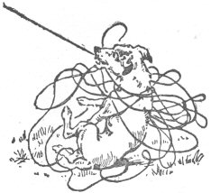
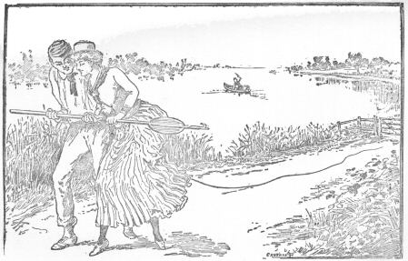
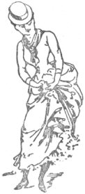
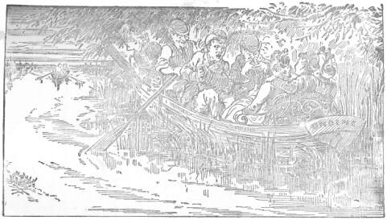

### CHAPTER IX.

*George is introduced to work.—Heathenish instincts of tow-lines.—Ungrateful conduct of a double-sculling skiff.—Towers and towed.—A use discovered for lovers.—Strange disappearance of an elderly lady.—Much haste, less speed.—Being towed by girls: exciting sensation.—The missing lock or the haunted river.—Music.—Saved!*

We made George work, now we had got him. He did not want to work, of course; that goes without saying. He had had a hard time in the City, so he explained. Harris, who is callous in his nature, and not prone to pity, said: 
“Ah! and now you are going to have a hard time on the river for a change; change is good for everyone. Out you get!” 
He could not in conscience—not even George’s conscience—object, though he did suggest that, perhaps, it would be better for him to stop in the boat, and get tea ready, while Harris and I towed, because getting tea was such a worrying work, and Harris and I looked tired. The only reply we made to this, however, was to pass him over the tow-line, and he took it, and stepped out. 

### 

There is something very strange and unaccountable about a tow-line. You roll it up with as much patience and care as you would take to fold up a new pair of trousers, and five minutes afterwards, when you pick it up, it is one ghastly, soul-revolting tangle. 
I do not wish to be insulting, but I firmly believe that if you took an average tow-line, and stretched it out straight across the middle of a field, and then turned your back on it for thirty seconds, that, when you looked round again, you would find that it had got itself altogether in a heap in the middle of the field, and had twisted itself up, and tied itself into knots, and lost its two ends, and become all loops; and it would take you a good half-hour, sitting down there on the grass and swearing all the while, to disentangle it again. 
That is my opinion of tow-lines in general. Of course, there may be honourable exceptions; I do not say that there are not. There may be tow-lines that are a credit to their profession—conscientious, respectable tow-lines—tow-lines that do not imagine they are crochet-work, and try to knit themselves up into antimacassars the instant they are left to themselves. I say there _may_ be such tow-lines; I sincerely hope there are. But I have not met with them. 
This tow-line I had taken in myself just before we had got to the lock. I would not let Harris touch it, because he is careless. I had looped it round slowly and cautiously, and tied it up in the middle, and folded it in two, and laid it down gently at the bottom of the boat. Harris had lifted it up scientifically, and had put it into George’s hand. George had taken it firmly, and held it away from him, and had begun to unravel it as if he were taking the swaddling clothes off a new-born infant; and, before he had unwound a dozen yards, the thing was more like a badly-made door-mat than anything else. 
It is always the same, and the same sort of thing always goes on in connection with it. The man on the bank, who is trying to disentangle it, thinks all the fault lies with the man who rolled it up; and when a man up the river thinks a thing, he says it. 
“What have you been trying to do with it, make a fishing-net of it? You’ve made a nice mess you have; why couldn’t you wind it up properly, you silly dummy?” he grunts from time to time as he struggles wildly with it, and lays it out flat on the tow-path, and runs round and round it, trying to find the end. 
On the other hand, the man who wound it up thinks the whole cause of the muddle rests with the man who is trying to unwind it. 
“It was all right when you took it!” he exclaims indignantly. “Why don’t you think what you are doing? You go about things in such a slap-dash style. You’d get a scaffolding pole entangled _you_ would!” 
And they feel so angry with one another that they would like to hang each other with the thing. Ten minutes go by, and the first man gives a yell and goes mad, and dances on the rope, and tries to pull it straight by seizing hold of the first piece that comes to his hand and hauling at it. Of course, this only gets it into a tighter tangle than ever. Then the second man climbs out of the boat and comes to help him, and they get in each other’s way, and hinder one another. They both get hold of the same bit of line, and pull at it in opposite directions, and wonder where it is caught. In the end, they do get it clear, and then turn round and find that the boat has drifted off, and is making straight for the weir. 
This really happened once to my own knowledge. It was up by Boveney, one rather windy morning. We were pulling down stream, and, as we came round the bend, we noticed a couple of men on the bank. They were looking at each other with as bewildered and helplessly miserable expression as I have ever witnessed on any human countenance before or since, and they held a long tow-line between them. It was clear that something had happened, so we eased up and asked them what was the matter. 
“Why, our boat’s gone off!” they replied in an indignant tone. “We just got out to disentangle the tow-line, and when we looked round, it was gone!” 
And they seemed hurt at what they evidently regarded as a mean and ungrateful act on the part of the boat. 
We found the truant for them half a mile further down, held by some rushes, and we brought it back to them. I bet they did not give that boat another chance for a week. 
I shall never forget the picture of those two men walking up and down the bank with a tow-line, looking for their boat. 
One sees a good many funny incidents up the river in connection with towing. One of the most common is the sight of a couple of towers, walking briskly along, deep in an animated discussion, while the man in the boat, a hundred yards behind them, is vainly shrieking to them to stop, and making frantic signs of distress with a scull. Something has gone wrong; the rudder has come off, or the boat-hook has slipped overboard, or his hat has dropped into the water and is floating rapidly down stream. 
He calls to them to stop, quite gently and politely at first. 

### 

“Hi! stop a minute, will you?” he shouts cheerily. “I’ve dropped my hat over-board.” 
Then: “Hi! Tom—Dick! can’t you hear?” not quite so affably this time. 
Then: “Hi! Confound _you_, you dunder-headed idiots! Hi! stop! Oh you—!” 
After that he springs up, and dances about, and roars himself red in the face, and curses everything he knows. And the small boys on the bank stop and jeer at him, and pitch stones at him as he is pulled along past them, at the rate of four miles an hour, and can’t get out. 
Much of this sort of trouble would be saved if those who are towing would keep remembering that they are towing, and give a pretty frequent look round to see how their man is getting on. It is best to let one person tow. When two are doing it, they get chattering, and forget, and the boat itself, offering, as it does, but little resistance, is of no real service in reminding them of the fact. 
As an example of how utterly oblivious a pair of towers can be to their work, George told us, later on in the evening, when we were discussing the subject after supper, of a very curious instance. 

### 

He and three other men, so he said, were sculling a very heavily laden boat up from Maidenhead one evening, and a little above Cookham lock they noticed a fellow and a girl, walking along the towpath, both deep in an apparently interesting and absorbing conversation. They were carrying a boat-hook between them, and, attached to the boat-hook was a tow-line, which trailed behind them, its end in the water. No boat was near, no boat was in sight. There must have been a boat attached to that tow-line at some time or other, that was certain; but what had become of it, what ghastly fate had overtaken it, and those who had been left in it, was buried in mystery. Whatever the accident may have been, however, it had in no way disturbed the young lady and gentleman, who were towing. They had the boat-hook and they had the line, and that seemed to be all that they thought necessary to their work. 
George was about to call out and wake them up, but, at that moment, a bright idea flashed across him, and he didn’t. He got the hitcher instead, and reached over, and drew in the end of the tow-line; and they made a loop in it, and put it over their mast, and then they tidied up the sculls, and went and sat down in the stern, and lit their pipes. 
And that young man and young woman towed those four hulking chaps and a heavy boat up to Marlow. 
George said he never saw so much thoughtful sadness concentrated into one glance before, as when, at the lock, that young couple grasped the idea that, for the last two miles, they had been towing the wrong boat. George fancied that, if it had not been for the restraining influence of the sweet woman at his side, the young man might have given way to violent language. 
The maiden was the first to recover from her surprise, and, when she did, she clasped her hands, and said, wildly: 
“Oh, Henry, then _where_ is auntie?” 
“Did they ever recover the old lady?” asked Harris. 
George replied he did not know. 
Another example of the dangerous want of sympathy between tower and towed was witnessed by George and myself once up near Walton. It was where the tow-path shelves gently down into the water, and we were camping on the opposite bank, noticing things in general. By-and-by a small boat came in sight, towed through the water at a tremendous pace by a powerful barge horse, on which sat a very small boy. Scattered about the boat, in dreamy and reposeful attitudes, lay five fellows, the man who was steering having a particularly restful appearance. 
“I should like to see him pull the wrong line,” murmured George, as they passed. And at that precise moment the man did it, and the boat rushed up the bank with a noise like the ripping up of forty thousand linen sheets. Two men, a hamper, and three oars immediately left the boat on the larboard side, and reclined on the bank, and one and a half moments afterwards, two other men disembarked from the starboard, and sat down among boat-hooks and sails and carpet-bags and bottles. The last man went on twenty yards further, and then got out on his head. 
This seemed to sort of lighten the boat, and it went on much easier, the small boy shouting at the top of his voice, and urging his steed into a gallop. The fellows sat up and stared at one another. It was some seconds before they realised what had happened to them, but, when they did, they began to shout lustily for the boy to stop. He, however, was too much occupied with the horse to hear them, and we watched them, flying after him, until the distance hid them from view. 
I cannot say I was sorry at their mishap. Indeed, I only wish that all the young fools who have their boats towed in this fashion—and plenty do—could meet with similar misfortunes. Besides the risk they run themselves, they become a danger and an annoyance to every other boat they pass. Going at the pace they do, it is impossible for them to get out of anybody else’s way, or for anybody else to get out of theirs. Their line gets hitched across your mast, and overturns you, or it catches somebody in the boat, and either throws them into the water, or cuts their face open. The best plan is to stand your ground, and be prepared to keep them off with the butt-end of a mast. 
Of all experiences in connection with towing, the most exciting is being towed by girls. It is a sensation that nobody ought to miss. It takes three girls to tow always; two hold the rope, and the other one runs round and round, and giggles. They generally begin by getting themselves tied up. They get the line round their legs, and have to sit down on the path and undo each other, and then they twist it round their necks, and are nearly strangled. They fix it straight, however, at last, and start off at a run, pulling the boat along at quite a dangerous pace. At the end of a hundred yards they are naturally breathless, and suddenly stop, and all sit down on the grass and laugh, and your boat drifts out to mid-stream and turns round, before you know what has happened, or can get hold of a scull. Then they stand up, and are surprised. 
“Oh, look!” they say; “he’s gone right out into the middle.” 

### 

They pull on pretty steadily for a bit, after this, and then it all at once occurs to one of them that she will pin up her frock, and they ease up for the purpose, and the boat runs aground. 
You jump up, and push it off, and you shout to them not to stop. 
“Yes. What’s the matter?” they shout back. 
“Don’t stop,” you roar. 
“Don’t what?” 
“Don’t stop—go on—go on!” 
“Go back, Emily, and see what it is they want,” says one; and Emily comes back, and asks what it is. 
“What do you want?” she says; “anything happened?” 
“No,” you reply, “it’s all right; only go on, you know—don’t stop.” 
“Why not?” 
“Why, we can’t steer, if you keep stopping. You must keep some way on the boat.” 
“Keep some what?” 
“Some way—you must keep the boat moving.” 
“Oh, all right, I’ll tell ’em. Are we doing it all right?” 
“Oh, yes, very nicely, indeed, only don’t stop.” 
“It doesn’t seem difficult at all. I thought it was so hard.” 
“Oh, no, it’s simple enough. You want to keep on steady at it, that’s all.” 
“I see. Give me out my red shawl, it’s under the cushion.” 
You find the shawl, and hand it out, and by this time another one has come back and thinks she will have hers too, and they take Mary’s on chance, and Mary does not want it, so they bring it back and have a pocket-comb instead. It is about twenty minutes before they get off again, and, at the next corner, they see a cow, and you have to leave the boat to chivy the cow out of their way. 
There is never a dull moment in the boat while girls are towing it. 
George got the line right after a while, and towed us steadily on to Penton Hook. There we discussed the important question of camping. We had decided to sleep on board that night, and we had either to lay up just about there, or go on past Staines. It seemed early to think about shutting up then, however, with the sun still in the heavens, and we settled to push straight on for Runnymead, three and a half miles further, a quiet wooded part of the river, and where there is good shelter. 
We all wished, however, afterward that we had stopped at Penton Hook. Three or four miles up stream is a trifle, early in the morning, but it is a weary pull at the end of a long day. You take no interest in the scenery during these last few miles. You do not chat and laugh. Every half-mile you cover seems like two. You can hardly believe you are only where you are, and you are convinced that the map must be wrong; and, when you have trudged along for what seems to you at least ten miles, and still the lock is not in sight, you begin to seriously fear that somebody must have sneaked it, and run off with it. 
I remember being terribly upset once up the river (in a figurative sense, I mean). I was out with a young lady—cousin on my mother’s side—and we were pulling down to Goring. It was rather late, and we were anxious to get in—at least _she_ was anxious to get in. It was half-past six when we reached Benson’s lock, and dusk was drawing on, and she began to get excited then. She said she must be in to supper. I said it was a thing I felt I wanted to be in at, too; and I drew out a map I had with me to see exactly how far it was. I saw it was just a mile and a half to the next lock—Wallingford—and five on from there to Cleeve. 
“Oh, it’s all right!” I said. “We’ll be through the next lock before seven, and then there is only one more;” and I settled down and pulled steadily away. 
We passed the bridge, and soon after that I asked if she saw the lock. She said no, she did not see any lock; and I said, “Oh!” and pulled on. Another five minutes went by, and then I asked her to look again. 
“No,” she said; “I can’t see any signs of a lock.” 
“You—you are sure you know a lock, when you do see one?” I asked hesitatingly, not wishing to offend her. 
The question did offend her, however, and she suggested that I had better look for myself; so I laid down the sculls, and took a view. The river stretched out straight before us in the twilight for about a mile; not a ghost of a lock was to be seen. 
“You don’t think we have lost our way, do you?” asked my companion. 
I did not see how that was possible; though, as I suggested, we might have somehow got into the weir stream, and be making for the falls. 
This idea did not comfort her in the least, and she began to cry. She said we should both be drowned, and that it was a judgment on her for coming out with me. 
It seemed an excessive punishment, I thought; but my cousin thought not, and hoped it would all soon be over. 
I tried to reassure her, and to make light of the whole affair. I said that the fact evidently was that I was not rowing as fast as I fancied I was, but that we should soon reach the lock now; and I pulled on for another mile. 
Then I began to get nervous myself. I looked again at the map. There was Wallingford lock, clearly marked, a mile and a half below Benson’s. It was a good, reliable map; and, besides, I recollected the lock myself. I had been through it twice. Where were we? What had happened to us? I began to think it must be all a dream, and that I was really asleep in bed, and should wake up in a minute, and be told it was past ten. 
I asked my cousin if she thought it could be a dream, and she replied that she was just about to ask me the same question; and then we both wondered if we were both asleep, and if so, who was the real one that was dreaming, and who was the one that was only a dream; it got quite interesting. 
I still went on pulling, however, and still no lock came in sight, and the river grew more and more gloomy and mysterious under the gathering shadows of night, and things seemed to be getting weird and uncanny. I thought of hobgoblins and banshees, and will-o’-the-wisps, and those wicked girls who sit up all night on rocks, and lure people into whirl-pools and things; and I wished I had been a better man, and knew more hymns; and in the middle of these reflections I heard the blessed strains of “He’s got ’em on,” played, badly, on a concertina, and knew that we were saved. 
I do not admire the tones of a concertina, as a rule; but, oh! how beautiful the music seemed to us both then—far, far more beautiful than the voice of Orpheus or the lute of Apollo, or anything of that sort could have sounded. Heavenly melody, in our then state of mind, would only have still further harrowed us. A soul-moving harmony, correctly performed, we should have taken as a spirit-warning, and have given up all hope. But about the strains of “He’s got ’em on,” jerked spasmodically, and with involuntary variations, out of a wheezy accordion, there was something singularly human and reassuring. 
The sweet sounds drew nearer, and soon the boat from which they were worked lay alongside us. 
It contained a party of provincial ’Arrys and ’Arriets, out for a moonlight sail. (There was not any moon, but that was not their fault.) I never saw more attractive, lovable people in all my life. I hailed them, and asked if they could tell me the way to Wallingford lock; and I explained that I had been looking for it for the last two hours. 
“Wallingford lock!” they answered. “Lor’ love you, sir, that’s been done away with for over a year. There ain’t no Wallingford lock now, sir. You’re close to Cleeve now. Blow me tight if ’ere ain’t a gentleman been looking for Wallingford lock, Bill!” 
I had never thought of that. I wanted to fall upon all their necks and bless them; but the stream was running too strong just there to allow of this, so I had to content myself with mere cold-sounding words of gratitude. 
We thanked them over and over again, and we said it was a lovely night, and we wished them a pleasant trip, and, I think, I invited them all to come and spend a week with me, and my cousin said her mother would be so pleased to see them. And we sang the soldiers’ chorus out of _Faust_, and got home in time for supper, after all. 

### 

 
