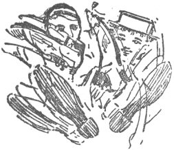
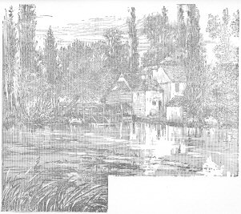
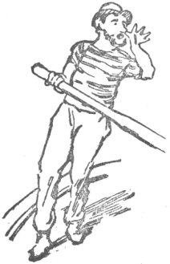

### CHAPTER XVIII.

*Locks.—George and I are photographed.—Wallingford.—Dorchester.—Abingdon.—A family man.—A good spot for drowning.—A difficult bit of water.—Demoralizing effect of river air.*

We left Streatley early the next morning, and pulled up to Culham, and slept under the canvas, in the backwater there. 
The river is not extraordinarily interesting between Streatley and Wallingford. From Cleve you get a stretch of six and a half miles without a lock. I believe this is the longest uninterrupted stretch anywhere above Teddington, and the Oxford Club make use of it for their trial eights. 
But however satisfactory this absence of locks may be to rowing-men, it is to be regretted by the mere pleasure-seeker. 
For myself, I am fond of locks. They pleasantly break the monotony of the pull. I like sitting in the boat and slowly rising out of the cool depths up into new reaches and fresh views; or sinking down, as it were, out of the world, and then waiting, while the gloomy gates creak, and the narrow strip of day-light between them widens till the fair smiling river lies full before you, and you push your little boat out from its brief prison on to the welcoming waters once again. 
They are picturesque little spots, these locks. The stout old lock-keeper, or his cheerful-looking wife, or bright-eyed daughter, are pleasant folk to have a passing chat with. {287} You meet other boats there, and river gossip is exchanged. The Thames would not be the fairyland it is without its flower-decked locks. 
Talking of locks reminds me of an accident George and I very nearly had one summer’s morning at Hampton Court. 
It was a glorious day, and the lock was crowded; and, as is a common practice up the river, a speculative photographer was taking a picture of us all as we lay upon the rising waters. 
I did not catch what was going on at first, and was, therefore, extremely surprised at noticing George hurriedly smooth out his trousers, ruffle up his hair, and stick his cap on in a rakish manner at the back of his head, and then, assuming an expression of mingled affability and sadness, sit down in a graceful attitude, and try to hide his feet. 
My first idea was that he had suddenly caught sight of some girl he knew, and I looked about to see who it was. Everybody in the lock seemed to have been suddenly struck wooden. They were all standing or sitting about in the most quaint and curious attitudes I have ever seen off a Japanese fan. All the girls were smiling. Oh, they did look so sweet! And all the fellows were frowning, and looking stern and noble. 
And then, at last, the truth flashed across me, and I wondered if I should be in time. Ours was the first boat, and it would be unkind of me to spoil the man’s picture, I thought. 
So I faced round quickly, and took up a position in the prow, where I leant with careless grace upon the hitcher, in an attitude suggestive of agility and strength. I arranged my hair with a curl over the forehead, and threw an air of tender wistfulness into my expression, mingled with a touch of cynicism, which I am told suits me. 
As we stood, waiting for the eventful moment, I heard someone behind call out: 
“Hi! look at your nose.” 
I could not turn round to see what was the matter, and whose nose it was that was to be looked at. I stole a side-glance at George’s nose! It was all right—at all events, there was nothing wrong with it that could be altered. I squinted down at my own, and that seemed all that could be expected also. 
“Look at your nose, you stupid ass!” came the same voice again, louder. 
And then another voice cried: 
“Push your nose out, can’t you, you—you two with the dog!” 
Neither George nor I dared to turn round. The man’s hand was on the cap, and the picture might be taken any moment. Was it us they were calling to? What was the matter with our noses? Why were they to be pushed out! 
But now the whole lock started yelling, and a stentorian voice from the back shouted: 
“Look at your boat, sir; you in the red and black caps. It’s your two corpses that will get taken in that photo, if you ain’t quick.” 
We looked then, and saw that the nose of our boat had got fixed under the woodwork of the lock, while the in-coming water was rising all around it, and tilting it up. In another moment we should be over. Quick as thought, we each seized an oar, and a vigorous blow against the side of the lock with the butt-ends released the boat, and sent us sprawling on our backs. 

### 

We did not come out well in that photograph, George and I. Of course, as was to be expected, our luck ordained it, that the man should set his wretched machine in motion at the precise moment that we were both lying on our backs with a wild expression of “Where am I? and what is it?” on our faces, and our four feet waving madly in the air. 
Our feet were undoubtedly the leading article in that photograph. Indeed, very little else was to be seen. They filled up the foreground entirely. Behind them, you caught glimpses of the other boats, and bits of the surrounding scenery; but everything and everybody else in the lock looked so utterly insignificant and paltry compared with our feet, that all the other people felt quite ashamed of themselves, and refused to subscribe to the picture. 
The owner of one steam launch, who had bespoke six copies, rescinded the order on seeing the negative. He said he would take them if anybody could show him his launch, but nobody could. It was somewhere behind George’s right foot. 
There was a good deal of unpleasantness over the business. The photographer thought we ought to take a dozen copies each, seeing that the photo was about nine-tenths us, but we declined. We said we had no objection to being photo’d full-length, but we preferred being taken the right way up. 
Wallingford, six miles above Streatley, is a very ancient town, and has been an active centre for the making of English history. It was a rude, mud-built town in the time of the Britons, who squatted there, until the Roman legions evicted them; and replaced their clay-baked walls by mighty fortifications, the trace of which Time has not yet succeeded in sweeping away, so well those old-world masons knew how to build. 
But Time, though he halted at Roman walls, soon crumbled Romans to dust; and on the ground, in later years, fought savage Saxons and huge Danes, until the Normans came. 
It was a walled and fortified town up to the time of the Parliamentary War, when it suffered a long and bitter siege from Fairfax. It fell at last, and then the walls were razed. 
From Wallingford up to Dorchester the neighbourhood of the river grows more hilly, varied, and picturesque. Dorchester stands half a mile from the river. It can be reached by paddling up the Thame, if you have a small boat; but the best way is to leave the river at Day’s Lock, and take a walk across the fields. Dorchester is a delightfully peaceful old place, nestling in stillness and silence and drowsiness. 
Dorchester, like Wallingford, was a city in ancient British times; it was then called Caer Doren, “the city on the water.” In more recent times the Romans formed a great camp here, the fortifications surrounding which now seem like low, even hills. In Saxon days it was the capital of Wessex. It is very old, and it was very strong and great once. Now it sits aside from the stirring world, and nods and dreams. 
Round Clifton Hampden, itself a wonderfully pretty village, old-fashioned, peaceful, and dainty with flowers, the river scenery is rich and beautiful. If you stay the night on land at Clifton, you cannot do better than put up at the “Barley Mow.” It is, without exception, I should say, the quaintest, most old-world inn up the river. It stands on the right of the bridge, quite away from the village. Its low-pitched gables and thatched roof and latticed windows give it quite a story-book appearance, while inside it is even still more once-upon-a-timeyfied. 
It would not be a good place for the heroine of a modern novel to stay at. The heroine of a modern novel is always “divinely tall,” and she is ever “drawing herself up to her full height.” At the “Barley Mow” she would bump her head against the ceiling each time she did this. 
It would also be a bad house for a drunken man to put up at. There are too many surprises in the way of unexpected steps down into this room and up into that; and as for getting upstairs to his bedroom, or ever finding his bed when he got up, either operation would be an utter impossibility to him. 
We were up early the next morning, as we wanted to be in Oxford by the afternoon. It is surprising how early one _can_ get up, when camping out. One does not yearn for “just another five minutes” nearly so much, lying wrapped up in a rug on the boards of a boat, with a Gladstone bag for a pillow, as one does in a featherbed. We had finished breakfast, and were through Clifton Lock by half-past eight. 
From Clifton to Culham the river banks are flat, monotonous, and uninteresting, but, after you get through Culhalm Lock—the coldest and deepest lock on the river—the landscape improves. 
At Abingdon, the river passes by the streets. Abingdon is a typical country town of the smaller order—quiet, eminently respectable, clean, and desperately dull. It prides itself on being old, but whether it can compare in this respect with Wallingford and Dorchester seems doubtful. A famous abbey stood here once, and within what is left of its sanctified walls they brew bitter ale nowadays. 
In St. Nicholas Church, at Abingdon, there is a monument to John Blackwall and his wife Jane, who both, after leading a happy married life, died on the very same day, August 21, 1625; and in St. Helen’s Church, it is recorded that W. Lee, who died in 1637, “had in his lifetime issue from his loins two hundred lacking but three.” If you work this out you will find that Mr. W. Lee’s family numbered one hundred and ninety-seven. Mr. W. Lee—five times Mayor of Abingdon—was, no doubt, a benefactor to his generation, but I hope there are not many of his kind about in this overcrowded nineteenth century. 
From Abingdon to Nuneham Courteney is a lovely stretch. Nuneham Park is well worth a visit. It can be viewed on Tuesdays and Thursdays. The house contains a fine collection of pictures and curiosities, and the grounds are very beautiful. 
The pool under Sandford lasher, just behind the lock, is a very good place to drown yourself in. The undercurrent is terribly strong, and if you once get down into it you are all right. An obelisk marks the spot where two men have already been drowned, while bathing there; and the steps of the obelisk are generally used as a diving-board by young men now who wish to see if the place really _is_ dangerous. 

### 

Iffley Lock and Mill, a mile before you reach Oxford, is a favourite subject with the river-loving brethren of the brush. The real article, however, is rather disappointing, after the pictures. Few things, I have noticed, come quite up to the pictures of them, in this world. 
We passed through Iffley Lock at about half-past twelve, and then, having tidied up the boat and made all ready for landing, we set to work on our last mile. 
Between Iffley and Oxford is the most difficult bit of the river I know. You want to be born on that bit of water, to understand it. I have been over it a fairish number of times, but I have never been able to get the hang of it. The man who could row a straight course from Oxford to Iffley ought to be able to live comfortably, under one roof, with his wife, his mother-in-law, his elder sister, and the old servant who was in the family when he was a baby. 
First the current drives you on to the right bank, and then on to the left, then it takes you out into the middle, turns you round three times, and carries you up stream again, and always ends by trying to smash you up against a college barge. 
Of course, as a consequence of this, we got in the way of a good many other boats, during the mile, and they in ours, and, of course, as a consequence of that, a good deal of bad language occurred. 
I don’t know why it should be, but everybody is always so exceptionally irritable on the river. Little mishaps, that you would hardly notice on dry land, drive you nearly frantic with rage, when they occur on the water. When Harris or George makes an ass of himself on dry land, I smile indulgently; when they behave in a chuckle-head way on the river, I use the most blood-curdling language to them. When another boat gets in my way, I feel I want to take an oar and kill all the people in it. 
The mildest tempered people, when on land, become violent and blood-thirsty when in a boat. I did a little boating once with a young lady. She was naturally of the sweetest and gentlest disposition imaginable, but on the river it was quite awful to hear her. 
“Oh, drat the man!” she would exclaim, when some unfortunate sculler would get in her way; “why don’t he look where he’s going?” 
And, “Oh, bother the silly old thing!” she would say indignantly, when the sail would not go up properly. And she would catch hold of it, and shake it quite brutally. 
Yet, as I have said, when on shore she was kind-hearted and amiable enough. 

### 

### 

The air of the river has a demoralising effect upon one’s temper, and this it is, I suppose, which causes even barge men to be sometimes rude to one another, and to use language which, no doubt, in their calmer moments they regret. 
 
