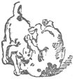
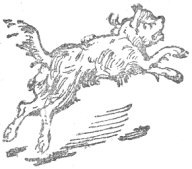
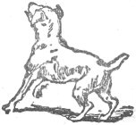
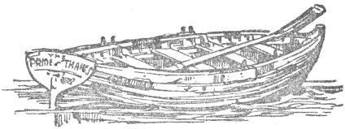
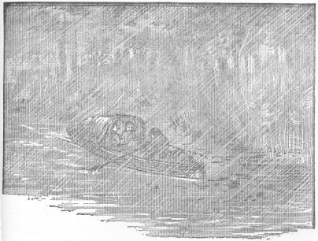
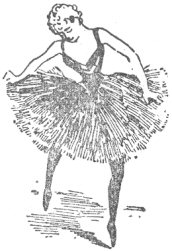
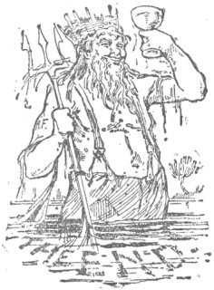

### CHAPTER XIX.

*Oxford.—Montmorency’s idea of Heaven.—The hired up-river boat, its beauties and advantages.—The “Pride of the Thames.”—The weather changes.—The river under different aspects.—Not a cheerful evening.—Yearnings for the unattainable.—The cheery chat goes round.—George performs upon the banjo.—A mournful melody.—Another wet day.—Flight.—A little supper and a toast.*

### 

We spent two very pleasant days at Oxford. There are plenty of dogs in the town of Oxford. Montmorency had eleven fights on the first day, and fourteen on the second, and evidently thought he had got to heaven. 

### 

Among folk too constitutionally weak, or too constitutionally lazy, whichever it may be, to relish up-stream work, it is a common practice to get a boat at Oxford, and row down. For the energetic, however, the up-stream journey is certainly to be preferred. It does not seem good to be always going with the current. There is more satisfaction in squaring one’s back, and fighting against it, and winning one’s way forward in spite of it—at least, so I feel, when Harris and George are sculling and I am steering. 

### 

To those who do contemplate making Oxford their starting-place, I would say, take your own boat—unless, of course, you can take someone else’s without any possible danger of being found out. The boats that, as a rule, are let for hire on the Thames above Marlow, are very good boats. They are fairly water-tight; and so long as they are handled with care, they rarely come to pieces, or sink. There are places in them to sit down on, and they are complete with all the necessary arrangements—or nearly all—to enable you to row them and steer them. 
But they are not ornamental. The boat you hire up the river above Marlow is not the sort of boat in which you can flash about and give yourself airs. The hired up-river boat very soon puts a stop to any nonsense of that sort on the part of its occupants. That is its chief—one may say, its only recommendation. 

### 

The man in the hired up-river boat is modest and retiring. He likes to keep on the shady side, underneath the trees, and to do most of his travelling early in the morning or late at night, when there are not many people about on the river to look at him. 
When the man in the hired up-river boat sees anyone he knows, he gets out on to the bank, and hides behind a tree. 
I was one of a party who hired an up-river boat one summer, for a few days’ trip. We had none of us ever seen the hired up-river boat before; and we did not know what it was when we did see it. 
We had written for a boat—a double sculling skiff; and when we went down with our bags to the yard, and gave our names, the man said: 

### 

“Oh, yes; you’re the party that wrote for a double sculling skiff. It’s all right. Jim, fetch round _The Pride of the Thames_.” 
The boy went, and re-appeared five minutes afterwards, struggling with an antediluvian chunk of wood, that looked as though it had been recently dug out of somewhere, and dug out carelessly, so as to have been unnecessarily damaged in the process. 
My own idea, on first catching sight of the object, was that it was a Roman relic of some sort,—relic of _what_ I do not know, possibly of a coffin. 
The neighbourhood of the upper Thames is rich in Roman relics, and my surmise seemed to me a very probable one; but our serious young man, who is a bit of a geologist, pooh-poohed my Roman relic theory, and said it was clear to the meanest intellect (in which category he seemed to be grieved that he could not conscientiously include mine) that the thing the boy had found was the fossil of a whale; and he pointed out to us various evidences proving that it must have belonged to the preglacial period. 
To settle the dispute, we appealed to the boy. We told him not to be afraid, but to speak the plain truth: Was it the fossil of a pre-Adamite whale, or was it an early Roman coffin? 
The boy said it was _The Pride of the Thames_. 
We thought this a very humorous answer on the part of the boy at first, and somebody gave him twopence as a reward for his ready wit; but when he persisted in keeping up the joke, as we thought, too long, we got vexed with him. 
“Come, come, my lad!” said our captain sharply, “don’t let us have any nonsense. You take your mother’s washing-tub home again, and bring us a boat.” 
The boat-builder himself came up then, and assured us, on his word, as a practical man, that the thing really was a boat—was, in fact, _the_ boat, the “double sculling skiff” selected to take us on our trip down the river. 
We grumbled a good deal. We thought he might, at least, have had it whitewashed or tarred—had _something_ done to it to distinguish it from a bit of a wreck; but he could not see any fault in it. 
He even seemed offended at our remarks. He said he had picked us out the best boat in all his stock, and he thought we might have been more grateful. 
He said it, _The Pride of the Thames_, had been in use, just as it now stood (or rather as it now hung together), for the last forty years, to _his_ knowledge, and nobody had complained of it before, and he did not see why we should be the first to begin. 
We argued no more. 
We fastened the so-called boat together with some pieces of string, got a bit of wall-paper and pasted over the shabbier places, said our prayers, and stepped on board. 
They charged us thirty-five shillings for the loan of the remnant for six days; and we could have bought the thing out-and-out for four-and-sixpence at any sale of drift-wood round the coast. 
The weather changed on the third day,—Oh! I am talking about our present trip now,—and we started from Oxford upon our homeward journey in the midst of a steady drizzle. 
The river—with the sunlight flashing from its dancing wavelets, gilding gold the grey-green beech-trunks, glinting through the dark, cool wood paths, chasing shadows o’er the shallows, flinging diamonds from the mill-wheels, throwing kisses to the lilies, wantoning with the weirs’ white waters, silvering moss-grown walls and bridges, brightening every tiny townlet, making sweet each lane and meadow, lying tangled in the rushes, peeping, laughing, from each inlet, gleaming gay on many a far sail, making soft the air with glory—is a golden fairy stream. 
But the river—chill and weary, with the ceaseless rain-drops falling on its brown and sluggish waters, with a sound as of a woman, weeping low in some dark chamber; while the woods, all dark and silent, shrouded in their mists of vapour, stand like ghosts upon the margin; silent ghosts with eyes reproachful, like the ghosts of evil actions, like the ghosts of friends neglected—is a spirit-haunted water through the land of vain regrets. 
Sunlight is the life-blood of Nature. Mother Earth looks at us with such dull, soulless eyes, when the sunlight has died away from out of her. It makes us sad to be with her then; she does not seem to know us or to care for us. She is as a widow who has lost the husband she loved, and her children touch her hand, and look up into her eyes, but gain no smile from her. 
We rowed on all that day through the rain, and very melancholy work it was. We pretended, at first, that we enjoyed it. We said it was a change, and that we liked to see the river under all its different aspects. We said we could not expect to have it all sunshine, nor should we wish it. We told each other that Nature was beautiful, even in her tears. 

### 

Indeed, Harris and I were quite enthusiastic about the business, for the first few hours. And we sang a song about a gipsy’s life, and how delightful a gipsy’s existence was!—free to storm and sunshine, and to every wind that blew!—and how he enjoyed the rain, and what a lot of good it did him; and how he laughed at people who didn’t like it. 
George took the fun more soberly, and stuck to the umbrella. 
We hoisted the cover before we had lunch, and kept it up all the afternoon, just leaving a little space in the bow, from which one of us could paddle and keep a look-out. In this way we made nine miles, and pulled up for the night a little below Day’s Lock. 
I cannot honestly say that we had a merry evening. The rain poured down with quiet persistency. Everything in the boat was damp and clammy. Supper was not a success. Cold veal pie, when you don’t feel hungry, is apt to cloy. I felt I wanted whitebait and a cutlet; Harris babbled of soles and white-sauce, and passed the remains of his pie to Montmorency, who declined it, and, apparently insulted by the offer, went and sat over at the other end of the boat by himself. 
George requested that we would not talk about these things, at all events until he had finished his cold boiled beef without mustard. 
We played penny nap after supper. We played for about an hour and a half, by the end of which time George had won fourpence—George always is lucky at cards—and Harris and I had lost exactly twopence each. 
We thought we would give up gambling then. As Harris said, it breeds an unhealthy excitement when carried too far. George offered to go on and give us our revenge; but Harris and I decided not to battle any further against Fate. 
After that, we mixed ourselves some toddy, and sat round and talked. George told us about a man he had known, who had come up the river two years ago and who had slept out in a damp boat on just such another night as that was, and it had given him rheumatic fever, and nothing was able to save him, and he had died in great agony ten days afterwards. George said he was quite a young man, and was engaged to be married. He said it was one of the saddest things he had ever known. 
And that put Harris in mind of a friend of his, who had been in the Volunteers, and who had slept out under canvas one wet night down at Aldershot, “on just such another night as this,” said Harris; and he had woke up in the morning a cripple for life. Harris said he would introduce us both to the man when we got back to town; it would make our hearts bleed to see him. 
This naturally led to some pleasant chat about sciatica, fevers, chills, lung diseases, and bronchitis; and Harris said how very awkward it would be if one of us were taken seriously ill in the night, seeing how far away we were from a doctor. 
There seemed to be a desire for something frolicksome to follow upon this conversation, and in a weak moment I suggested that George should get out his banjo, and see if he could not give us a comic song. 
I will say for George that he did not want any pressing. There was no nonsense about having left his music at home, or anything of that sort. He at once fished out his instrument, and commenced to play “Two Lovely Black Eyes.” 
I had always regarded “Two Lovely Black Eyes” as rather a commonplace tune until that evening. The rich vein of sadness that George extracted from it quite surprised me. 
The desire that grew upon Harris and myself, as the mournful strains progressed, was to fall upon each other’s necks and weep; but by great effort we kept back the rising tears, and listened to the wild yearnful melody in silence. 
When the chorus came we even made a desperate effort to be merry. We re-filled our glasses and joined in; Harris, in a voice trembling with emotion, leading, and George and I following a few words behind: 
“Two lovely black eyes; Oh! what a surprise! Only for telling a man he was wrong, Two—” 
There we broke down. The unutterable pathos of George’s accompaniment to that “two” we were, in our then state of depression, unable to bear. Harris sobbed like a little child, and the dog howled till I thought his heart or his jaw must surely break. 
George wanted to go on with another verse. He thought that when he had got a little more into the tune, and could throw more “abandon,” as it were, into the rendering, it might not seem so sad. The feeling of the majority, however, was opposed to the experiment. 
There being nothing else to do, we went to bed—that is, we undressed ourselves, and tossed about at the bottom of the boat for some three or four hours. After which, we managed to get some fitful slumber until five a.m., when we all got up and had breakfast. 
The second day was exactly like the first. The rain continued to pour down, and we sat, wrapped up in our mackintoshes, underneath the canvas, and drifted slowly down. 
One of us—I forget which one now, but I rather think it was myself—made a few feeble attempts during the course of the morning to work up the old gipsy foolishness about being children of Nature and enjoying the wet; but it did not go down well at all. That— 
“I care not for the rain, not I!” 
was so painfully evident, as expressing the sentiments of each of us, that to sing it seemed unnecessary. 
On one point we were all agreed, and that was that, come what might, we would go through with this job to the bitter end. We had come out for a fortnight’s enjoyment on the river, and a fortnight’s enjoyment on the river we meant to have. If it killed us! well, that would be a sad thing for our friends and relations, but it could not be helped. We felt that to give in to the weather in a climate such as ours would be a most disastrous precedent. 
“It’s only two days more,” said Harris, “and we are young and strong. We may get over it all right, after all.” 
At about four o’clock we began to discuss our arrangements for the evening. We were a little past Goring then, and we decided to paddle on to Pangbourne, and put up there for the night. 
“Another jolly evening!” murmured George. 
We sat and mused on the prospect. We should be in at Pangbourne by five. We should finish dinner at, say, half-past six. After that we could walk about the village in the pouring rain until bed-time; or we could sit in a dimly-lit bar-parlour and read the almanac. 

### 

“Why, the Alhambra would be almost more lively,” said Harris, venturing his head outside the cover for a moment and taking a survey of the sky. 
“With a little supper at the --- {311} to follow,” I added, half unconsciously. 
“Yes it’s almost a pity we’ve made up our minds to stick to this boat,” answered Harris; and then there was silence for a while. 
“If we _hadn’t_ made up our minds to contract our certain deaths in this bally old coffin,” observed George, casting a glance of intense malevolence over the boat, “it might be worth while to mention that there’s a train leaves Pangbourne, I know, soon after five, which would just land us in town in comfortable time to get a chop, and then go on to the place you mentioned afterwards.” 
Nobody spoke. We looked at one another, and each one seemed to see his own mean and guilty thoughts reflected in the faces of the others. In silence, we dragged out and overhauled the Gladstone. We looked up the river and down the river; not a soul was in sight! 
Twenty minutes later, three figures, followed by a shamed-looking dog, might have been seen creeping stealthily from the boat-house at the “Swan” towards the railway station, dressed in the following neither neat nor gaudy costume: 
Black leather shoes, dirty; suit of boating flannels, very dirty; brown felt hat, much battered; mackintosh, very wet; umbrella. 
We had deceived the boatman at Pangbourne. We had not had the face to tell him that we were running away from the rain. We had left the boat, and all it contained, in his charge, with instructions that it was to be ready for us at nine the next morning. If, we said—_if_ anything unforeseen should happen, preventing our return, we would write to him. 
We reached Paddington at seven, and drove direct to the restaurant I have before described, where we partook of a light meal, left Montmorency, together with suggestions for a supper to be ready at half-past ten, and then continued our way to Leicester Square. 
We attracted a good deal of attention at the Alhambra. On our presenting ourselves at the paybox we were gruffly directed to go round to Castle Street, and were informed that we were half-an-hour behind our time. 
We convinced the man, with some difficulty, that we were _not_ “the world-renowned contortionists from the Himalaya Mountains,” and he took our money and let us pass. 
Inside we were a still greater success. Our fine bronzed countenances and picturesque clothes were followed round the place with admiring gaze. We were the cynosure of every eye. 
It was a proud moment for us all. 
We adjourned soon after the first ballet, and wended our way back to the restaurant, where supper was already awaiting us. 
I must confess to enjoying that supper. For about ten days we seemed to have been living, more or less, on nothing but cold meat, cake, and bread and jam. It had been a simple, a nutritious diet; but there had been nothing exciting about it, and the odour of Burgundy, and the smell of French sauces, and the sight of clean napkins and long loaves, knocked as a very welcome visitor at the door of our inner man. 
We pegged and quaffed away in silence for a while, until the time came when, instead of sitting bolt upright, and grasping the knife and fork firmly, we leant back in our chairs and worked slowly and carelessly—when we stretched out our legs beneath the table, let our napkins fall, unheeded, to the floor, and found time to more critically examine the smoky ceiling than we had hitherto been able to do—when we rested our glasses at arm’s-length upon the table, and felt good, and thoughtful, and forgiving. 
Then Harris, who was sitting next the window, drew aside the curtain and looked out upon the street. 
It glistened darkly in the wet, the dim lamps flickered with each gust, the rain splashed steadily into the puddles and trickled down the water-spouts into the running gutters. A few soaked wayfarers hurried past, crouching beneath their dripping umbrellas, the women holding up their skirts. 
“Well,” said Harris, reaching his hand out for his glass, “we have had a pleasant trip, and my hearty thanks for it to old Father Thames—but I think we did well to chuck it when we did. Here’s to Three Men well out of a Boat!” 
And Montmorency, standing on his hind legs, before the window, peering out into the night, gave a short bark of decided concurrence with the toast. 

### 

 
Footnotes. 
{287} Or rather _were_. The Conservancy of late seems to have constituted itself into a society for the employment of idiots. A good many of the new lock-keepers, especially in the more crowded portions of the river, are excitable, nervous old men, quite unfitted for their post. 
{311} A capital little out-of-the-way restaurant, in the neighbourhood of ---, where you can get one of the best-cooked and cheapest little French dinners or suppers that I know of, with an excellent bottle of Beaune, for three-and-six; and which I am not going to be idiot enough to advertise. 
