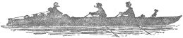

PREFACE.

_The chief beauty of this book lies not so much in its literary style_, _or in the extent and usefulness of the information it conveys_, _as in its simple truthfulness_. _Its pages form the record of events that really happened_. _All that has been done is to colour them_; _and_, _for this_, _no extra charge has been made_. _George and Harris and Montmorency are not poetic ideals_, _but things of flesh and blood—especially George_, _who weighs about twelve stone_. _Other works may excel this in depth of thought and knowledge of human nature: other books may rival it in originality and size_; _but_, _for hopeless and incurable veracity_, _nothing yet discovered can surpass it_. _This_, _more than all its other charms_, _will_, _it is felt_, _make the volume precious in the eye of the earnest reader_; _and will lend additional weight to the lesson that the story teaches_.

LONDON, _August_, 1889.

### 
